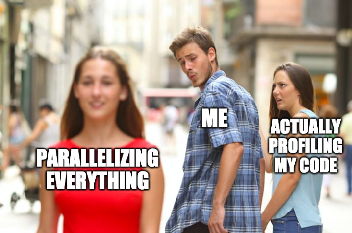

```{r setup, include = FALSE, warning = FALSE}
# Load xaringan theme
library(xaringanthemer)
style_mono_accent(
  header_font_google = google_font("Text Me One"),
  text_font_google   = google_font("Glacial Indifference", "300", "300i"),
  code_font_google   = google_font("Fira Mono"),
  base_color = "#003E54",
  white_color = "#93C6C2",
  background_color = "#FFFFFF",
  header_font_weight = 400,
  header_h1_font_size = "2.25rem",
  header_h2_font_size = "1.75rem",
  header_h3_font_size = "1.5rem",
  footnote_font_size = "0.7em",
)

# Load packages
library(tidyverse)
```

# **About me**

Project Researcher at the National Center for Ecological Analysis and Synthesis (NCEAS) and the Environmental Market Solutions Lab (emLab), UC Santa Barbara

`r icons::fontawesome("envelope", style = "solid")` [dferraro@ucsb.edu](mailto:dferraro@ucsb.edu)
`r icons::fontawesome("twitter", style = "brands")` [@dm_ferraro](https://twitter.com/dm_ferraro)

---

# **About you**

<!-- 
Zoom poll: 
Q1. Is this your first R-Ladies SB workshop?
- I've attended R-Ladies SB meetups before
- I've been to other R-Ladies meetups, but not SB
- This is my first time!
Q2. What is your experience with R?
- Beginner
- Intermediate
- Advanced
Q3. What is your experience with parallel computing?
- I don't know what it is
- I know what it is, but don't currently use it
- I sometimes parallelize my code
- I could basically teach this workshop
Q4. What operating system do you use most frequently with R?
- Mac
- Windows
- Linux
-->

---

# **Disclaimer**

.center[
```{r echo = FALSE, out.width = '80%'}
 
```
]

---

# **Recommended resources**

Resources I used for this workshop:

- [Parallel Computing in R, James Henderson, University of Michigan ](https://jbhender.github.io/Stats506/F20/Parallel_Computing_R.html)
- [Introduction to Parallel Computing Tutorial, Lawrence Livermore National Laboratory](https://hpc.llnl.gov/training/tutorials/introduction-parallel-computing-tutorial)
- [Parallel programming lecture, Grant McDermott, University of Oregon](https://raw.githack.com/uo-ec607/lectures/master/12-parallel/12-parallel.html)

Other helpful reference material:

- [CRAN Task View: High-Performance and Parallel Computing with R](https://CRAN.R-project.org/view=HighPerformanceComputing)
- [`foreach` package](https://github.com/RevolutionAnalytics/foreach)
- [`future` package](https://github.com/HenrikBengtsson/future)
- [`furrr` package](https://github.com/DavisVaughan/furrr)
- [`future.apply` package](https://github.com/HenrikBengtsson/future.apply)
---
class: center, middle, inverse
# Overview

---

# **Overview**

1. [What is parallel processing?](#what-is)
2. [When to use it](#when-to)
3. [When *not* to use it](#when-not)
4. [R packages for parallelization](#r-packages)
  - [`parallel`](#parallel)
  - [`foreach`](#foreach)
  - [`furrr`](#furrr)
  - [`future.apply`](#futureapply)
5. [Caveats and things to keep in mind](#caveats)
6. [Sample code walkthrough](#samplecode)

<br><br>

.center[
`r icons::fontawesome("github", style = "brands")`<br>
These slides are available at:<br> [https://danielleferraro.github.io/rladies-sb-parallel/](https://danielleferraro.github.io/rladies-sb-parallel/)<br><br>
GitHub repo with sample code is available at:<br> [github.com/danielleferraro/rladies-sb-parallel](https://github.com/danielleferraro/rladies-sb-parallel)
]
  
---

class: center, middle, inverse
name: what-is
# What is parallel processing?

---

# **What is parallel processing?**

--

A method where a process is broken up into smaller parts that can then be carried out **simultaneously**, i.e., **in parallel**

---

# **What is parallel processing?**

--

Traditionally, software is written for **serial processing**

--

.center[
```{r echo = FALSE, out.width = '100%'}
knitr::include_graphics("img/serial1.png")
```
]

---

# **What is parallel processing?**

Traditionally, software is written for **serial processing**

.center[
```{r echo = FALSE, out.width = '100%'}
knitr::include_graphics("img/serial2.png")
```
]

---

# **What is parallel processing?**

Traditionally, software is written for **serial processing**

.center[
```{r echo = FALSE, out.width = '100%'}
knitr::include_graphics("img/serial3.png")
```
]

---

# **What is parallel processing?**

Traditionally, software is written for **serial processing**

.center[
```{r echo = FALSE, out.width = '100%'}
knitr::include_graphics("img/serial4.png")
```
]

---

# **What is parallel processing?**

Running tasks **in parallel** enables us to use multiple computing resources simultaneously to solve a computational problem  

--

.center[
```{r echo = FALSE, out.width = '100%'}
knitr::include_graphics("img/serial1.png")
```
]

---

# **What is parallel processing?**

Running tasks **in parallel** enables us to use multiple computing resources simultaneously to solve a computational problem  


.center[
```{r echo = FALSE, out.width = '100%'}

```
]

---

# **What is parallel processing?**

Running tasks **in parallel** enables us to use multiple computing resources simultaneously to solve a computational problem  

.center[
```{r echo = FALSE, out.width = '100%'}
knitr::include_graphics("img/parallel2.png")
```
]

---

# **What is parallel processing?**

Running tasks **in parallel** enables us to use multiple computing resources simultaneously to solve a computational problem  

.center[
```{r echo = FALSE, out.width = '100%'}

```
]

---

# **What is parallel processing?**

Running tasks **in parallel** enables us to use multiple computing resources simultaneously to solve a computational problem  

.center[
```{r echo = FALSE, out.width = '100%'}
knitr::include_graphics("img/parallel4.png")
```
]

---

# **What is parallel processing?**

### Benefit: task speedup

More of your computer's resources used -> Multiple computations run at the same time -> less overall time needed

---

# **What is parallel processing?**

### Some jargon

- A **core** is the part of your computer's processor that performs computations
  
  - Most modern computers have >1 core

--
  
- A **process** is a single running task or program (like R) - each core runs one process at a time
  
--

- A **cluster** typically refers to a network of computers that work together (each with many cores), but it can also mean the collection of cores on your personal computer
  
  - In this workshop, we'll be focusing on the latter

---

class: center, middle, inverse
name: when-to
# When to use parallel processing

---

# **When to use parallel processing**

When tasks are **embarassingly parallel**, i.e. if your analysis could easily be separated into many identical but separate tasks that do not rely on one another

Examples:

- Bootstrapping
- Monte Carlo simulations
- Computations by group

--

Parallel processing is not effective with something like:

```{r, eval = FALSE}
function(a) {
  b <- a + 1
  c <- b + 2
  d <- c + 3
  return(d)
}
```

where each step depends on the one before it, so they cannot be completed at the same time.

---

# **When to use parallel processing**

When tasks are **embarassingly parallel**, i.e. if your analysis could easily be separated into many identical but separate tasks that do not rely on one another

Examples:

- Bootstrapping
- Monte Carlo simulations
- Computations by group

--

**AND**

When tasks are computationally intensive and take time to complete

---

class: center, middle, inverse
name: when-not
# When *not* to use parallel processing

---

# **When *not* to use parallel processing**

.center[
```{r echo = FALSE, out.width = '60%'}

```
]

--

.center[
### Just because we can, doesn't mean we should 
]

---

# **When *not* to use parallel processing**
 
.center[
### It is not magic! 
]

--

.center[
```{r echo = FALSE, out.width = '60%'}

```
]

---

# **When *not* to use parallel processing** 

### As a first step, always **profile** your code.

--

> 1. Find the biggest bottleneck (the slowest part of your code).
> 2. Try to eliminate it (you may not succeed but that’s ok).
> 3. Repeat until your code is “fast enough.”

.right[
-[Advanced R, Hadley Wickham](http://adv-r.had.co.nz/Profiling.html)
]

--

### A few suggestions:

- Embrace vectorization 
- Use functional programming: the `apply` (base) or `map` (`purrr` package) functions 
- Test out different packages: the `data.table` world is significantly faster than the `tidyverse`

---

# **When *not* to use parallel processing** 

### It may not be the right tool for the job.

--

.center[Look familiar? You may be memory limited<sup>1</sup>

```{r echo = FALSE, out.width = '60%'}

```

]

.footnote[
<sup>1</sup> Try chunking or simplifying your data
]

---

# **When *not* to use parallel processing**

### It may not be efficient.

.pull-left[
.center[(A) There is computational overhead for setting up, maintaining, and terminating multiple processors 

For small processes, the overhead cost may be greater than the speedup!
]
]

--

.pull-right[
.center[(B) Efficiency gains are limited by the proportion of your code that can be parallelized - see [Amdahl's Law](https://en.wikipedia.org/wiki/Amdahl%27s_law)

```{r echo = FALSE, out.width = '100%'}
knitr::include_graphics("img/amdahls_law_graph.png")

```

]
]

---

class: center, middle, inverse
name: caveats
# Caveats and things to keep in mind

---

# **Caveats and things to keep in mind**

- Implementation varies across operating systems

  - Two ways that code can be parallelized: **forking** vs **sockets**
  - **Forking** is faster, but doesn't work on Windows and may cause problems in IDEs like RStudio
  - **Sockets** are a bit slower, but work across operating systems and in IDEs
  
  
--
  
- Debugging can be tricky

--

- Be careful when generating random numbers across processes (R has some [strategies](https://www.r-bloggers.com/2020/09/future-1-19-1-making-sure-proper-random-numbers-are-produced-in-parallel-processing/) to deal with this)

---

class: center, middle, inverse
name: r-packages
# R packages for parallelization

---

# R packages for parallelization

### There are numerous approaches for parallelizing code in R.

--

1. The `parallel` package is a built-in base R package
2. The `future` package is newer and a bit friendlier (**recommended**)

Many different R packages for parallel processing exist, but they leverage either `parallel` or `future` as a *backend*, or both (and let us decide which to use).

--

Today, we will cover:

- `parallel`
- `dopar` (can use `parallel` or `future`)
- `furrr` (uses `future`)
- `future.apply` (uses `future`)

...but there are many others

- Check out [multidplyr](https://github.com/tidyverse/multidplyr)

---

name: parallel
# **The `parallel` package**

**Purpose:** parallel versions of apply functions. Note that it is operating system dependent.

Unix/Linux: 
```{r eval = FALSE}
# Serial
lapply(1:10, sqrt)

# Parallel
mclapply(1:10, sqrt, mc.cores = 4) # Specify 4 cores
```


--

&zwj;Windows:

```{r eval = FALSE}
# Serial
lapply(1:10, sqrt)

# Parallel 
cluster <- makePSOCKcluster(4) # Specify 4 cores
parLapply(cluster, 1:10, sqrt)`
```

.footnote[
<sup>1</sup> Disclaimer: The code on this and the following slides would never be parallelized in practice - they are just examples to highlight package syntax.
]

---

name: foreach
# **The `foreach` package**

**Purpose:** allows you to use `for` loops in parallel and choose your backend (e.g. `parallel` vs. `future`)

```{r eval = FALSE}
# Serial
for(i in 1:10) print(sqrt(i))

# Parallel 
cluster <- makeCluster(4) # Specify 4 cores
doParallel::registerDoParallel(cluster) # using {parallel} backend
foreach(i = 1:10) %dopar% {
  sqrt(i)
}
cluster <- makeCluster(4) # Specify 4 cores
doFuture::registerDoFuture(cluster) # using {future} backend
foreach(i = 1:10) %dopar% {
  sqrt(i)
}
```

---

name: furrr
# **The `furrr` package**

**Purpose:** parallel versions of `purrr::map()` functions using futures

```{r, eval = FALSE}
# Serial
map_dbl(1:10, sqrt)

# Parallel
plan(multisession)
future_map_dbl(1:10, sqrt)
```

---

name: futureapply
# **The `future.apply` package**

**Purpose:** parallel versions of `apply()` functions using futures

```{r eval = FALSE}
# Serial
lapply(1:10, sqrt)

# Parallel 
future_lapply(1:10, sqrt)
```


---

name: samplecode
class: center, middle

# Sample code

To follow along during the live coding session: [sample_code.Rmd](https://github.com/danielleferraro/rladies-sb-parallel/blob/main/sample_code/sample_code.Rmd)<br>
If you'd like to write the code along with me: [sample_code_blank.Rmd](https://github.com/danielleferraro/rladies-sb-parallel/blob/main/sample_code/sample_code_blank.Rmd)

